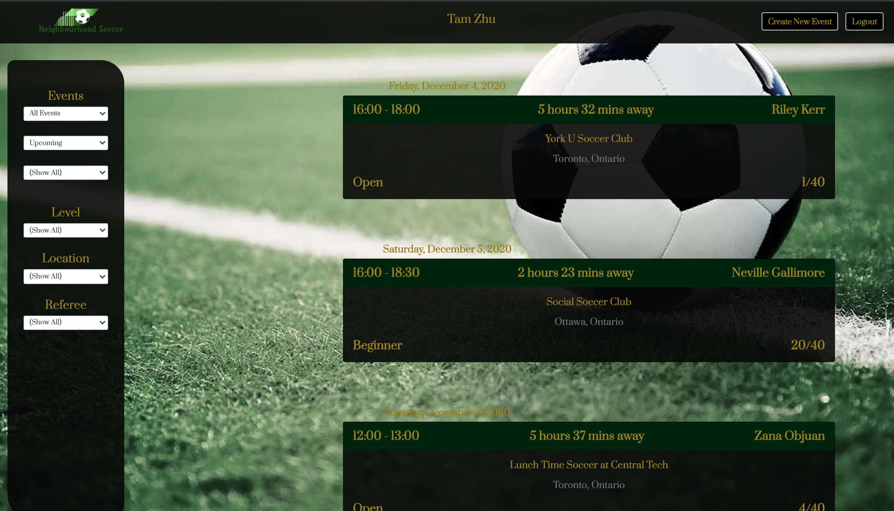
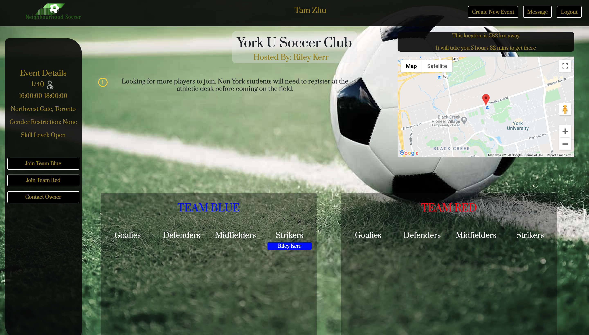
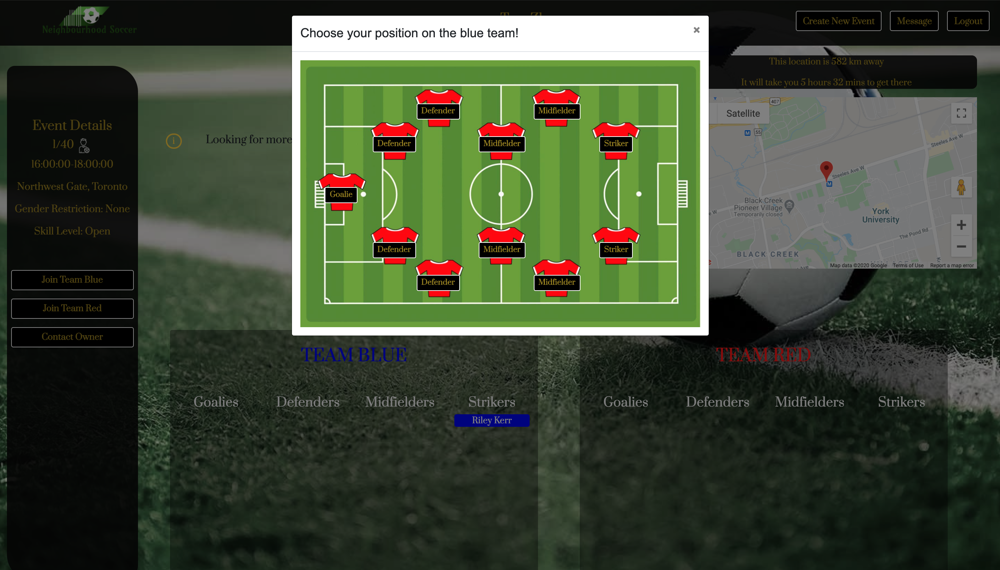
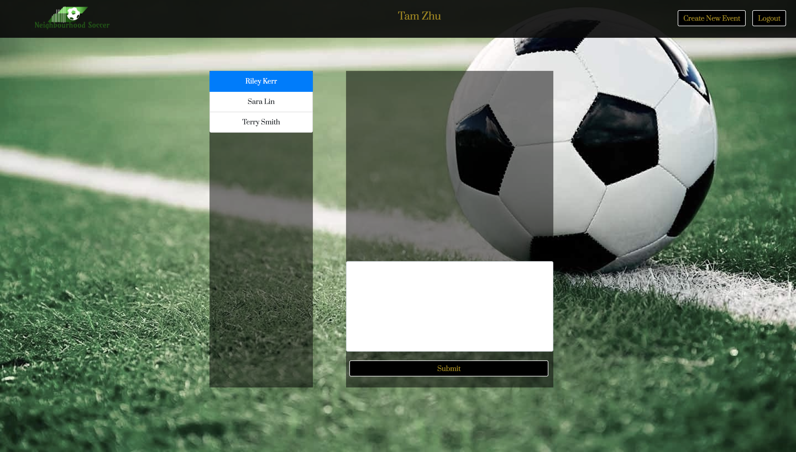

# Community Soccer
This is the final project for the Lighthouse Labs web development bootcamp prepared by [Bill Watters](https://github.com/WattersIV), [Ozge Guner](https://github.com/ozggnr) and [George Tang](https://github.com/georgecctang).

## Motivation
One challenge soccer lovers face is that it is difficult to organize a proper game. For a game that requires a minimum of 22 players, having many fellow players available at the same time can be difficult. On top of that, not every players are willing to switch from their favorite positions, leading to imbalanced teams (e.g. a team with many strikers but no defeneder.)

With this app, users can propose a soccer game in their neighbourhood. They can also specify criteria including skill levels and gender restrictions. Other users can look for games that they're interested in, and while joining the game, they can also specify the position they play.

Additionally, game owners can also specify whether the game will be referreed. Locals who are interested in refereeing can participate in the game as a referee. They can contact the owner with the private chat feature to discuss the details.

## Walk-through
After login or register, the user will be directed to the events index page. It lists all the games proposed by all users. Users can use the filter on the left to show only the games that fulfill the specified criteria (gender restriction, location,  skill level, and whether the game is refereed).

In the event details page, users can see the details of the game along with the map of the location. Users can join the game by specifying his desired team and position. They can also leave a comment, or leave the game if they are no longer interested.

Users can also choose a position which they would like to play.

Additionally, the users can contact the game owner through private messaging. Potential referees can use this feature to chat with the owners about the details, and possibly negotiate a price.

## Packages
### Front-end
* @material-ui/core
* @material-ui/lab
* axios
* bcrpyt
* bootstrap
* classnames
* cookie-session
* date-fns
* dotenv
* google-maps-react
* lodash
* material-ui
* material-ui-icons
* node-sass
* react
* react-bootstrap
* react-dom
* react-router-dom
* react-scripts
* react-spring
* web-vitals

### Backend
* axios
* bcrypt
* body-parser
* cookie-session
* cors
* date-fns
* dotenv
* express
* helmet
* lodash
* morgan
* node-sass
* nodemon
* pg
* uuid
* ws

## Setup
1. Download the project folder.
2. Install the packages by running `npm install` in both the front-end and the back-end folders.
3. Setup psql database.
4. Create data tables by running the file `/backend/src/db/schema/01_schema.sql`.
5. Seed data tatbles by funning all the files in `/backend/src/db/seeds/` sequentially.
6. Start the backend server by running `npm start` in the back-end folder.
7. Start the front end page by running `npm start` in the front-end.
8. Register for a new account.

